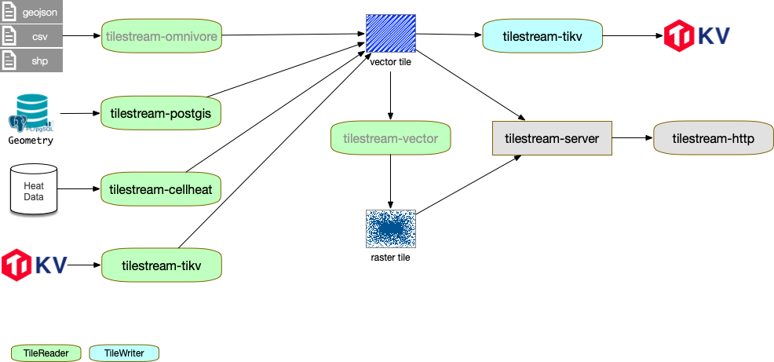

# TileStream

The tile process echo system

TileStream is designed for streaming map tiles from *sources* (like custom geographic data formats) to *sinks* (destinations, like file systems) by providing a consistent API. 

TileStream plugins (modules) follow a consistent architecture (defined in [API.md](https://git.aimap.io/maps/tilestream/blob/master/API.md)) and implement the logic for generating and reading map tiles from a source or putting map tiles to a destination, or both.

## Basic Concept

1. Map Tile

   数据内容格式不限：图片、矢量图层、数据块

   遵循墨卡托投影方式下的Tile层级规范

2. *TileReader*

   Response for reading tile from sources.

3. *TileWriter*

   Response for writing tile to sinks.

4. *TileInfo*

   Meta information for the tile repository.

## TileStream Plugins

- [tilestream-cellheat](https://git.aimap.io/maps/tilestream-cellheat) - Implements the tile stream API for generate s2 cell heat map from raw data to vector tiles.
- [tilestream-postgis](https://git.aimap.io/maps/tilestream-postgis) - A tilestream tile reader for outputting PBF-encoded tiles from PostGIS.
- [tilestream-server](https://git.aimap.io/maps/tilestream-server) - A tilestream-based tile server.

## Echosystem of tilestream



## Usage

### TileReader Plugin

1. Implement the TileReader interface

   ```go
   type CellHeat struct {
   }
   
   func (c CellHeat) Tile(x, y, z int32) ([]byte, *tilestream.ReaderOptions, error) {
     // implement the get Tile method
   }
   
   func (c CellHeat) Info() (*tilestream.TileInfo, error) {
     // implement the get Info method
   }
   ```

2. Register the plugin

   ```go
   func init() {
   	createReader := func(config tilestream.Config) tilestream.TileReader {
       return &CellHeat{} // should init the plugin here
   	}
   	tilestream.RegisterReader("cellheat", createReader)
   }
   ```

   

### Implement a TileWriter Plugin

### Using the Plugins

1. load the reader

   ```go
   reader := tilestream.LoadReader("cellheat", nil)
   ```

2. use the reader

   ```go
   tile, _, err := reader.Tile(x, y, level)
   if err != nil {
   	return nil, err
   }
   logs.Debug("get tile", x, y, level, len(tile))
   ```


参数传递

tile url 

```url
/maps/tilestream/v1/layers/{layer}/tiles/{level}/{x}/{y}?date=2019-10-23
```

Layer:

```yaml
TemplateLayers:
	cell-heat-wise:
	  type: cell-heat
	  source:
	    type: http
		  url: https://wise.newayz.com/positioning/wise/v1/inspection/executions/tiles/{cell_tokens}?date={{date}}&access_key=5hlKj1icxbxXCoLZ1QwWmO2OyGOjhmCC
		source:
		  type: kv
		  url: tikv://1200.12.0
		levels:
			- min: 15
			  max: 22
			  cell: 13
			- min: 7
			  max: 14
			  cell: 11
Layers:
   postgis-place-db:
     type: postgis
     server:
     	url: /maps/tilestream/v1/layers/{layer}/tiles/{level}/{x}/{y}
     	headers:
     		Cache-Control: max-age=72000
     		Content-Type: application/vnd.wayz-vector-tile
```


